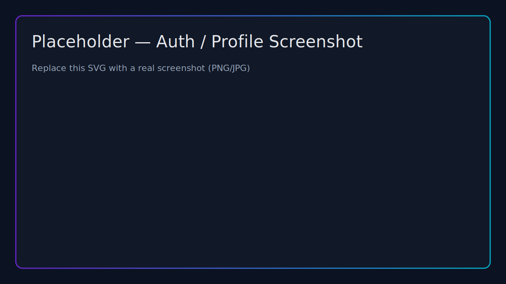
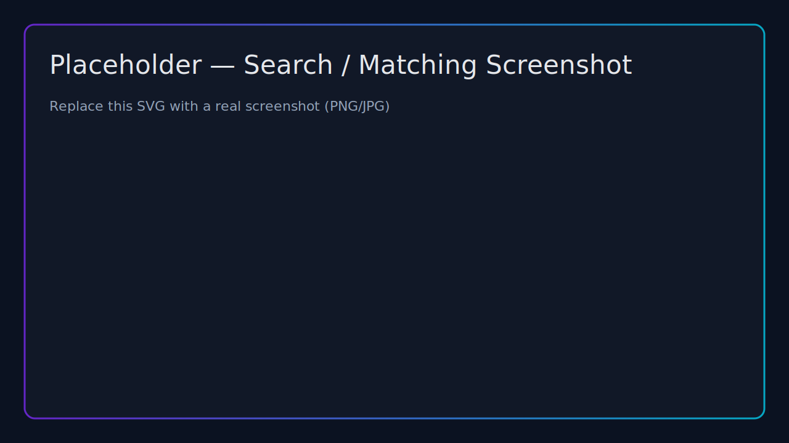
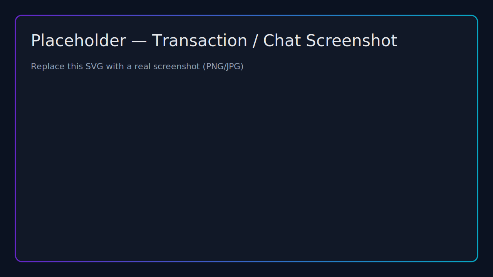

<!-- markdownlint-disable MD033 MD032 -->

<!-- Title -->
# Hyperlocal SkillSwap

Trade skills with neighbors — no money, just time

Presenter: [Your Name] · Date: [Event/Date]

---

## Objectives / Goal

- Build a trusted, hyperlocal skill exchange network
- Enable fair, cashless exchanges via time credits
- Reduce friction: simple discovery, chat, and completion flow
- Strengthen community ties and increase access to help

Notes:
- Success = more completed exchanges + stronger neighborhood ties.
- Emphasize fairness via 1 hour earned = 1 hour to spend.

---

## Problem Statement

- Hard to find affordable, trustworthy local help quickly
- Idle skills remain underutilized in neighborhoods
- Gig apps optimize for price, not reciprocity or community
- Informal groups (FB/Nextdoor) lack structure for reliable follow-through

Notes:
- Relatable story: need quick tech help without a costly, impersonal gig.
- Fragmentation and unreliable fulfillment are common pain points.

---

## Problem Solution

- Hyperlocal marketplace to match offered and needed skills
- Time credits: 1 hour earned = 1 hour to spend
- Structured flow: request → chat → confirm → complete → review
- Trust via proximity, profiles, and post-exchange reviews

Notes:
- Core mechanic: reciprocity through time credits, not cash.
- Keep journey clear end-to-end.

---

## Market Analysis

- Audience: neighbors, students, retirees, creators; urban + campus clusters
- TAM/SAM/SOM: local services + community platforms; phased city rollouts
- Competitors: TaskRabbit, Nextdoor, Facebook Groups, timebanking orgs
- Differentiation: cashless reciprocity, hyperlocal matching, structured transactions

Notes:
- Position vs gig (price-centric) and social groups (unstructured).
- Pilot geographies with density for liquidity.

---

## Business Model

- Value: fair exchanges, local trust, access without cash
- Partners: community orgs, campuses, coworking and maker spaces
- Channels: ambassadors, partnerships, events, social groups
- Cost structure: hosting, support/moderation, growth, community ops

Notes:
- Lead with value proposition and go-to-market channels.
- Lightweight costs with SaaS infra and phased growth.

---

## Start-up Plan

- Phase 1 (MVP): auth, profiles, skills, search, transactions, reviews
- Phase 2: notifications, saved searches, moderation tools, PWA
- Phase 3: Redis-backed realtime scale, community programs, badges
- GTM: 1–2 pilot neighborhoods/campuses with ambassadors

Notes:
- Phases focus on liquidity and trust, not only features.
- Validate behavior loops and onboarding via pilots.

---

## Revenue Generation

- Premium placement for offers/requests (non-intrusive)
- Community subscriptions for admin tools (schools/HOAs/coworking)
- Sponsored listings or local partner promotions
- Optional credit top-ups/donations; minimal/no ads to preserve trust

Notes:
- Prioritize models aligned with community value.
- Keep core exchanges free; monetize visibility/org features.

---

## Screenshots

  

Auth, profiles, and onboarding

  

  

Search, matching, and messaging

  

Notes:
- Replace placeholders with actual screenshots from your deployment.

---

## Flow & Transaction

Request → chat → confirm → complete → review → credits update

Notes:
- Keep the live demo to ~60–90 seconds.

---

## Conclusion

- Reciprocity, not price, aligns incentives and builds trust
- Simple, structured flow lowers friction and increases completion
- Pilot-ready with a clear path to scale and monetization
- Ask: partners, pilot communities, early ambassadors

Notes:
- Recap the thesis and restate the ask.

---

## Q&A

- Contact: <your email/handle>
- Demo: [https://example.com](https://example.com)
- Backup: architecture diagram and screenshots available

Notes:
- Keep key metrics and roadmap details handy.
